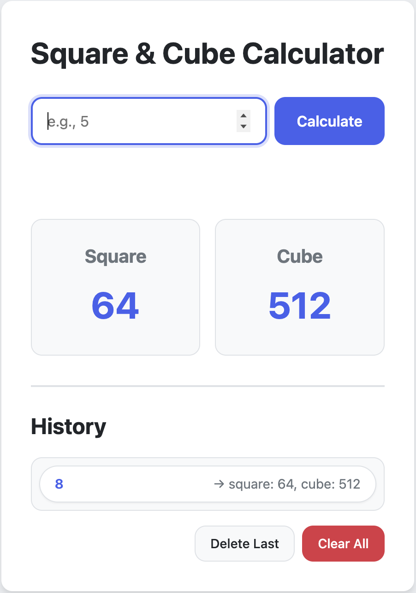
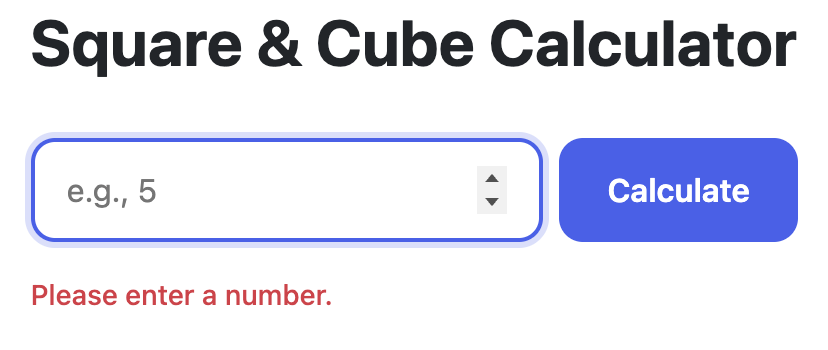
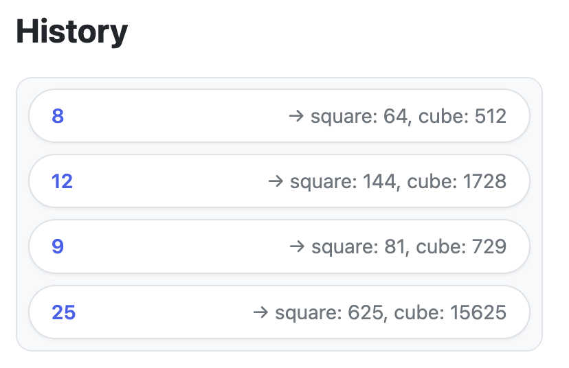
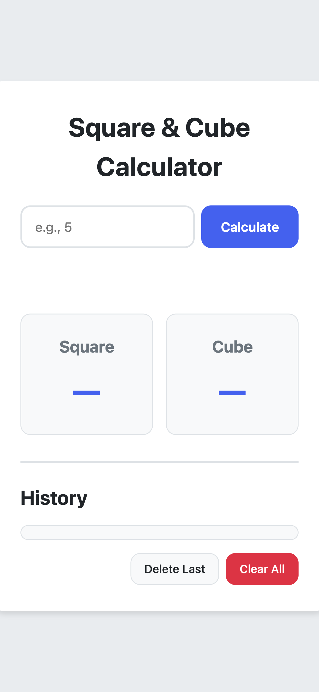

# 🧮 Square & Cube Calculator


A clean, accessible, and user‑friendly web app that instantly calculates the **square** and **cube** of any number you enter. Built with modern HTML5, CSS3, and JavaScript—now with enhanced UI/UX and full keyboard support.


*Main interface – enter a number, see results, and track your history.*

---

## ✨ Features

- **Instant Results** – Get square and cube values as soon as you hit *Calculate* (or press `Enter`).
- **History Log** – Every calculation is saved with the original number, its square, and its cube.
- **Delete & Clear** – Remove the last entry or wipe the entire history with one click.
- **Keyboard Friendly** – Focus on the input, type a number, and press `Enter` – no mouse needed.
- **Responsive Design** – Works beautifully on desktop, tablet, and mobile.
- **Accessibility Ready** – ARIA labels, focus indicators, and semantic HTML for screen readers.

---

## 🎨 UI/UX & Design Improvements

This project was carefully refined to follow modern best practices:

- **Typography** – Uses a system‑font stack for native readability and a clear hierarchy (headings, results, labels).
- **Colour & Contrast** – High‑contrast colours meet WCAG standards; a calming blue primary with neutral backgrounds.
- **Visual Feedback** – Buttons have hover/focus states, input fields highlight, and errors appear with polite alerts.
- **Layout** – Card‑based results, grouped history actions, and consistent spacing create a clean, intuitive interface.
- **Error Handling** – Friendly messages guide you when input is empty or invalid.
- **Reduced Motion** – Respects `prefers-reduced-motion` for users who prefer less animation.

> 📸 **Screenshot:** Error message in action  
>  

---

## 🧱 Built With

- **HTML5** – Semantic structure (`<main>`, `<section>`, `<ul>`)
- **CSS3** – Flexbox, Grid, custom properties, and a dedicated reset file
- **JavaScript (ES6)** – Event handling, DOM manipulation, live region updates

---

## 🚀 Live Demo

Check out the live version hosted on GitHub Pages:  
👉 [**Square-Cube-Calculator Demo**](https://nothypro.github.io/Square-Cube-Calculator/)

---

## 📸 Screenshots

| Main View | History & Results |
|-----------|-------------------|
|  |  |

| Mobile View | Error State |
|-------------|-------------|
|  |  |
---

## 🛠️ How to Use

1. **Enter a number** in the input field (e.g., `5`).
2. Click **Calculate** or press `Enter` – the square (`25`) and cube (`125`) appear instantly.
3. Each calculation is added to the history below.
4. Use **Delete Last** to remove the most recent entry, or **Clear All** to empty the history.

---

## 📁 Project Structure

```
Square-Cube-Calculator/
├── index.html
├── README.md
├── css/
│   ├── reset.css
│   └── style.css
├── js/
│   └── main.js
└── screenshots/
    ├── calculator-main.png
    ├── calculator-error.png
    ├── calculator-history.png
    └── calculator-mobile.png
```
---

## 🙏 Acknowledgements

- Inspired by the need for a simple, accessible calculator.
- Built with guidance from UI/UX best practices and accessibility standards.

---

**Happy Calculating!** 🎉